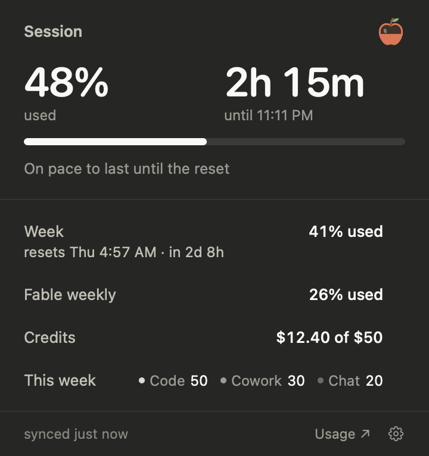
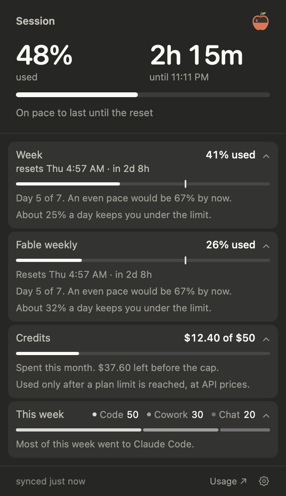
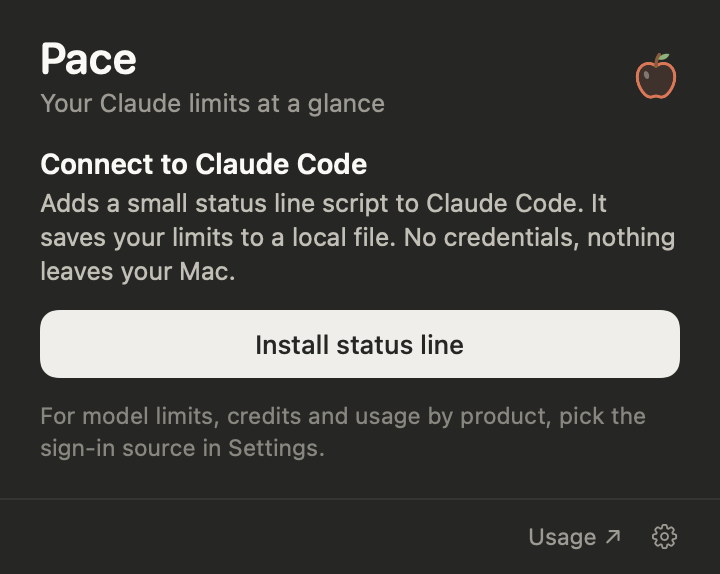

# Pace

A calm macOS menu bar app for your Claude usage. One glance tells you how much of your session and week you have used, when it resets, and whether you are on pace.

> Unofficial. Not affiliated with or endorsed by Anthropic. "Claude" is a trademark of Anthropic, used here only to say what the app works with.

<p align="center">
  
  
  
</p>

## Quick start

You need macOS 14 or newer and the Xcode Command Line Tools (`xcode-select --install`).

```sh
git clone https://github.com/Anirudh64210/pace.git
cd pace
make install
```

Pace is built, copied to Applications and opened. An apple appears in your menu bar. Click it, press **Install status line**, then send any message in Claude Code. Your numbers appear a moment later.

That is the only time you need the terminal. Pace starts by itself when you log in, and **⌃⌥P** (Control-Option-P) opens it from any app; you can record any other shortcut in Settings. If you quit it, open it from Spotlight like any other app.

## What you see

**At the top, your session:** how much is used and how long until it resets, side by side, over one bar ("48% used · 2h 15m until 1:34 AM"). Under them, one line says what that means: "On pace to last until the reset", or, in orange, "At this pace, it runs out around 1:05 AM". Once the weekly limit is reached, the top switches to the week.

**Below, one quiet list.** Every number is "% used":

- **Week**, with its reset always visible: "resets Wed 6:42 AM · in 2d 8h".
- **Model limits**, such as "Fable weekly", when your plan has them.
- **Credits** spent this month, or "Off".
- **This week**: how your usage splits between Claude Code, Cowork and Chat.

**Click a row for the detail behind it.** It opens in place with a bar showing where an even pace would be, which day of the week it is, and how much a day keeps you under the limit. Open as many rows as you like; they stay open next time.

Time is always shown in hours and minutes, never seconds.

<p align="center"></p>

**When something changes,** a small pill drops from under the menu bar icon for a few seconds, like the Focus pill: your session hits its limit or comes back, the week is reached or resets, or you are running fast enough to run out early. Each change shows once. The pill never takes focus or blocks a click. System notifications are available in Settings as an extra.

## Everyday use

| Do this | To |
|---|---|
| Click the apple, or press your shortcut (⌃⌥P by default) | Open or close the panel. Esc or a click elsewhere closes it too. |
| Hover a number or a button | See a two-word label saying what it is. |
| Click a row | Open or close its detail. |
| Click the apple inside the panel | See your approximate token total, with a doomscrolling comparison. |
| Right-click the apple | Refresh, Settings, Start at Login, Quit. |

Closing the panel keeps Pace running. Quit it from the right-click menu or the bottom of Settings.

## Where the numbers come from

Choose a source in Settings. Both use the Claude sign-in you already have: there is no API key to set up.

| | Claude Code status line (default) | Claude sign-in |
|---|---|---|
| How it works | Claude Code hands its limits to a small script, which saves them to a local file | Pace asks Anthropic's usage endpoint, with the sign-in Claude Code keeps in your Keychain |
| Credentials | None | Your Claude Code sign-in, kept in memory only |
| Updates | While Claude Code runs | Every 5 minutes, every minute near a limit |
| Shows | Session and week | Also model limits, credits and usage by product |

**Status line.** Install adds `~/.claude/pace-statusline.sh` and points Claude Code at it, keeping a backup of your settings. If you already had a status line, it keeps working: the script runs your command. **Settings › Remove** undoes everything and restores your old status line exactly. In Claude Code the script also prints `● on track  38% session · 2h 14m  59% week · Thu`.

**Claude sign-in.** Select it and it connects, normally with no password prompt. Settings shows "Connected" and your plan. It works whether you use Claude Code in a terminal or the Claude desktop app: Pace reads both places the sign-in is kept and uses the fresher one. The sign-in lasts about 8 hours and is renewed by Claude Code (including the desktop app's Code tab), never by Pace. If you only chat for longer than that, Pace pauses calmly with your last numbers and picks up the renewed sign-in within a minute of your next Claude Code use. The token is a full account credential, so read [SECURITY.md](SECURITY.md) first. The endpoint is not documented by Anthropic and could change, and using it may be subject to Anthropic's terms.

### Known limitation: long chat-only days

The sign-in source borrows Claude Code's sign-in, which lasts about 8 hours and is renewed only when Claude Code runs. That includes Claude Code in a terminal and the Claude desktop app's Code tab (and, as far as we can tell, Cowork). Chatting, in the desktop app or the browser, does not renew it.

So if you only chat for more than about 8 hours, Pace pauses: it keeps your last numbers on screen with "Paused · numbers from …" in the footer. As soon as anything in Claude Code runs, even one message in the Code tab, Pace picks up the renewed sign-in within a minute and carries on.

This is deliberate. The alternatives were:

| Option | Why Pace does not do it |
|---|---|
| Pace renews the sign-in itself | Anthropic's renewal credentials work once. If Pace renewed while Claude Code or the desktop app still held the old one, that app would be signed out and you would have to log in again. |
| Read the desktop app's own chat sign-in | It is stored inside the app's encrypted browser data. Reading it means a Keychain password prompt, handling a more powerful credential, and possibly breaking Anthropic's terms. |

Pace only ever reads the sign-in, so it can never sign you out of anything. If Anthropic offers a supported way to read usage in the future, Pace should switch to it.

## Privacy and security

Pace runs entirely on your Mac: no server, no analytics, no account. It never reads your conversations. Its only network request is the optional usage check, to `api.anthropic.com`. The sign-in token is never written to disk or logged, redirects are refused, and nothing about the request is cached. [SECURITY.md](SECURITY.md) lists every file Pace writes and every guarantee, with the tests that check them.

## Troubleshooting

Start with:

```sh
make check
```

It tests both sources once and prints what each sees, for example `session 12% used, resets in 4h 24m; credits off`. It reads your Claude Code sign-in to test the second source, and never prints the token.

- **"Almost there" does not go away.** Send a message in Claude Code, or restart Claude Code once if it was open during the install. Limits are only reported on Pro and Max plans.
- **Credits say "Off".** Extra usage is not on for your account. **Usage ↗** in the panel footer opens the page where you can turn it on.
- **No model limits, credits or product split.** Those need the Claude sign-in source.
- **The shortcut does nothing.** Another app may use it. In Settings, click the shortcut and press a different one.
- **The shortcut shown does not match the keys you press.** Pace shows the keys as macOS names them. On a Windows-layout or third-party keyboard, Alt is Option (⌥) and the Windows key is Command (⌘), and some keyboards swap the two. In Settings, click the shortcut and press the keys you want; Pace records exactly what macOS receives.
- **"Paused · numbers from …" in the footer.** Your Claude sign-in needs renewing. Use Claude Code once (a terminal or the desktop app's Code tab); Pace resumes within a minute.
- **"Couldn't update" in the footer.** Pace keeps your last numbers and retries on its own. If your sign-in expired, open Claude Code once.
- **The status line says Pace needs the Command Line Tools.** Run `xcode-select --install`.

Still stuck? Open an issue with the output of `make check`.

## Uninstall

1. In Pace, open **Settings** and press **Remove** next to the status line.
2. Run `make uninstall`, or move `/Applications/Pace.app` to the Trash.
3. Optionally delete `~/Library/Application Support/Pace` (your last numbers and a token-count cache).

## Development

```sh
make demo          # fake data that cycles through every state
swift test         # unit, layout, security, installer and fuzz tests
make run           # run from the terminal
make app           # build build/Pace.app
make screenshots   # re-render docs/screenshots
```

No third-party dependencies. `Package.swift` also opens in Xcode.

| Path | Contents |
|---|---|
| `Sources/Pace/App` | Entry point, menu bar item and panel window, polling, events |
| `Sources/Pace/Model` | Snapshots, state rules, panel text, formatting. Pure and unit tested |
| `Sources/Pace/Providers` | The two data sources, the Keychain read, the token counter |
| `Sources/Pace/UI` | SwiftUI views, the status pill. `Theme.swift` holds every color and size |
| `Sources/Pace/System` | Settings, notifications, status line installer, shortcut, launch cleanup |
| `scripts/` | The status line script and the icon generator |
| `docs/` | Design notes and the README screenshots |

Read [CONTRIBUTING.md](CONTRIBUTING.md) before sending a change.

## Design

How Pace looks and behaves, and why, is in [docs/DESIGN.md](docs/DESIGN.md).

## License

MIT. See [LICENSE](LICENSE).
